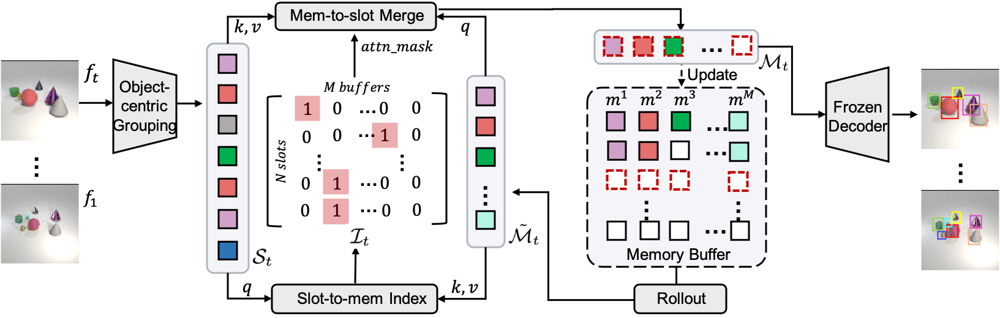

# Object-Centric Multiple Object Tracking (OC-MOT)
This is the official implementation of the ICCV'23 paper [Object-Centric Multiple Object Tracking](https://arxiv.org/abs/2309.00233). The code was implemented by [Zixu Zhao](https://github.com/zxzhaoeric), [Jiaze Wang](https://jiazewang.com/), [Max Horn](https://github.com/ExpectationMax) and [Tianjun Xiao](http://tianjunxiao.com/).

## Introduction



OC-MOT  is a framework designed to perform multiple object tracking on object-centric representations without object ID labels. It consists of an index-merge module that adapts the object-centric slots into detection outputs and an unsupervised memory module that builds complete object prototypes to handle occlusions. Benefited from object-centric learning, we only requires sparse detection labels for object localization and feature binding. Our experiments significantly narrow the gap between the existing object-centric model and the fully supervised state-of-the-art and outperform several unsupervised trackers.


## Development Setup
Installing OC-MOT requires at least python3.8. Installation can be done using [poetry](https://python-poetry.org/docs/#installation).  After installing `poetry`, check out the repo and setup a development environment:

```bash
git clone https://github.com/amazon-science/object-centric-learning-framework.git
cd object-centric-multiple-object-tracking
poetry install
```

This installs the `ocl` package and the cli scripts used for running experiments in a poetry managed virtual environment. Activate the poetry virtual environment `poetry shell` before running the experiments.

## Running experiments

Experiments are defined in the folder `configs/experiment` and can be run
by setting the experiment variable. For example, if we run OC-MOT on Cater dataset, we can follow: 

```bash
poetry run python -m ocl.cli.train +experiment=OC-MOT/cater
poetry run python -m ocl.cli.eval +experiment=OC-MOT/cater_eval
```

The result is saved in a timestamped subdirectory in `outputs/<experiment_name>`, i.e. `outputs/OC-MOT/cater/<date>_<time>` in the above case. The prefix path `outputs` can be configured using the `experiment.root_output_path` variable.

Besides, you can use `tensorboard` for visualization:

```bash
cd outputs/<experiment_name>
tensorboard --logdir version_0
```
## Checkpoints
The pre-trained models will be uploaded soon.

## Demo
MOT performance comparison with video object-centric model SAVi:


Extension to real-world videos. We point out in the main paper that existing object-centric models show bad detection / segmentation performance on real-world videos. However, one highlight of this work is our novel framework to learn object association in a self-supervised manner, which is agnostic to the detection module. For real-world purposes, we replace the detection module with [SEEM](https://arxiv.org/abs/2304.06718) and train OC-MOT with self-supervised feature loss. From the visualizations below, we also observe quite inspring tracking performance on objects such as persons and cars.


## Citation
Please cite our paper if you find this repo useful!

```bibtex
@article{zhao2023object,
  title={Object-Centric Multiple Object Tracking},
  author={Zhao, Zixu and Wang, Jiaze and Horn, Max and Ding, Yizhuo and He, Tong and Bai, Zechen and Zietlow, Dominik and Simon-Gabriel, Carl-Johann and Shuai, Bing and Tu, Zhuowen and others},
  journal={arXiv preprint arXiv:2309.00233},
  year={2023}
}
```
Related projects that this paper is developed upon:
```bibtex
@misc{oclf,
  author = {Max Horn and Maximilian Seitzer and Andrii Zadaianchuk and Zixu Zhao and Dominik Zietlow and Florian Wenzel and Tianjun Xiao},
  title = {Object Centric Learning Framework (version 0.1)},
  year  = {2023},
  url   = {https://github.com/amazon-science/object-centric-learning-framework},
}
```

## License
This project is licensed under the Apache-2.0 License.
